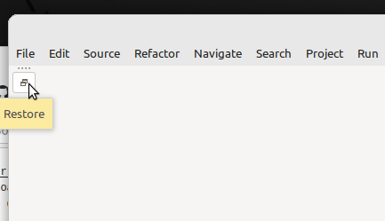

### Table of contents

Click on the  icon, on the right-hand side above.

# Overview

This short tutorial describes a way to make a virtual machine (VM) configured for ESP32 software development with Espressif IDE, based on Eclipse. It also explains how to start using it. The virtualization environment is VirtualBox, and the guest machine runs Linux Mint.

Versions are:

* Linux Mint Xfce: 21.3
* Espressif-IDE 2.12.1 (based on Eclipse IDE 2023-12)
* ESP-IDF: 5.2.1

# Prerequisites

* Hardware: a 64-bit computer with enough memory so that the VM can be granted 4 GB, with a few tens of GB available on the disk, and one free USB A port
* Hardware (bis): an [Espressif ESP32-C6-DevKitM-1](https://docs.espressif.com/projects/espressif-esp-dev-kits/en/latest/esp32c6/esp32-c6-devkitm-1/index.html) with a USB C cable to connect it to the computer
* Software development competencies: 
  * Basic knowledge of Linux (knowing the most common commands...)
  * Basic knowledge of VirtualBox (knowing how to create a virtual machine...)
  * Good knowledge of one programming language

# Creation of the VM

Check [this guide](https://github.com/PascalBod/lm-vm) to create a Linux Mint Xfce 21.3 VM.

# VM configuration

## Reference documents

* [Espressif documentation](https://github.com/espressif/idf-eclipse-plugin)

## Prerequisites

First, install the prerequisites: Java, Python, Git. Start the Synaptic package manager (main menu then **Settings > Synaptic Package Manager**). Then install the packages listed in the sections below.

### Java

Install **openjdk-21-jdk**.

### Python

Install **python3-venv** and **python3-pip** packages.

### Git

Install **git** package.

## Espressif-IDE

[Download the Linux version of the Espressif-IDE](https://github.com/espressif/idf-eclipse-plugin/blob/master/docs/Espressif-IDE.md#downloads).

At the time of writing, the file name is `Espressif-IDE-2.12.1-linux.gtk.x86_64.tar.gz`.

In the file manager, double-click the file and extract the content to the `~/DevTools` directory (to be created).

Add a launcher to the main menu:
* Right click on the main menu icon and select **Edit Applications**
* Select the `Development` directory
* Click the **+** tool and select **Add Launcher**
* For **Command**, select `/home/developer/DevTools/Espressif-IDE/espressif-ide`
* Click the launcher icon and select `/home/developer/DevTools/Espressif-IDE/icon.xpm`
* Click the `New Launcher` string and replace it by `Espressif-IDE`
* Click the `A small descriptive blurb about this application.` string and replace it by `Espressif-IDE`
* Click the **Save Launcher** tool
* Close the window

# Espressif-IDE configuration

Start Espressif-IDE with the launcher you just created.

Modify the proposed workspace path, replacing it with `/home/developer/Dev/workspace`.

In Espressif-IDE window menu, select **Espressif > Download and Configure ESP-IDF**.

Keep the proposed v5.2.1 version. Set the download directory to `/home/developer/DevTools`.

Click the **Finish** button.

After the ESP-IDF download completion, accept to install the tools. Beware: the **Install Tools** window wich is then displayed my be behind Espressif-IDE window. Ensure to bring it back to foreground. Keep the default values for ESP-IDF directory, for git location and python location, and click the **Install Tools** button.

When the **Progress** tab says `No operations to display at this time.`, the configuration is done.

click on the **Restore** icon on the left-hand side of the window:



The **Console** view displays the following messages:
```
Copying OpenOCD Rules
Copying File: /home/developer/.espressif/tools/openocd-esp32/v0.12.0-esp32-20230921/openocd-esp32/bin/../share/openocd/contrib/60-openocd.rules to destination: /etc/udev/rules.d/60-openocd.rules
Unable to copy rules for OpenOCD to system directory, try running the eclipse with sudo command
```

In a terminal, run the command as requested:
```shell
$ sudo cp /home/developer/.espressif/tools/openocd-esp32/v0.12.0-esp32-20230921/openocd-esp32/bin/../share/openocd/contrib/60-openocd.rules /etc/udev/rules.d/60-openocd.rules
```

# ESP32-C6-DevKitM-1 connection

Connect the board to a USB port of the computer. Use the board USB port marked **USB**.

Check that the virtual machine can see it, with **Devices > USB**. A new USB device should be visible: **Espressif USB JTAG/serial debug unit**. Tick the associated checkbox.

You can assign the board to the virtual machine on a permanent basis with **Devices > USB > USB Settings...**.

# Sample application

[Create a new project](https://github.com/espressif/idf-eclipse-plugin#create-a-new-project-using-esp-idf-templates), choosing the *hello_world* template. The template selection is now on the same page as the project name input. Select **esp32c6** for project target.

Build the project, as explained [here](https://github.com/espressif/idf-eclipse-plugin?tab=readme-ov-file#compiling-the-project).

Flash the project, as explained [here](https://github.com/espressif/idf-eclipse-plugin?tab=readme-ov-file#flashing-the-project). Check the target configuration by clicking the gear wheel on the right-hand side of the launch target drop-down: **Serial Port** should be set to **/dev/ttyACM0 USB JTAG/serial debug unit**.

To display trace messages printed by the application, [start a terminal](https://github.com/espressif/idf-eclipse-plugin#viewing-serial-output). **Serial port** should be set to **/dev/ttyACM0**.

# Upgrade

To upgrade ESP-IDF, select **Espressif > Download and Configure ESP-IDF** and select the ESP-IDF version to download. Once downloaded, the ESP-IDF plugin might ask you to install a new set of tools. Accept, and install the tools. 

To upgrade the Eclipse IDF plugin, check [this section](https://github.com/espressif/idf-eclipse-plugin#how-do-i-upgrade-my-existing-idf-eclipse-plugin).


### Ccache

Ccache improves build time. Install it:

```shell
$ sudo apt install ccache
```

